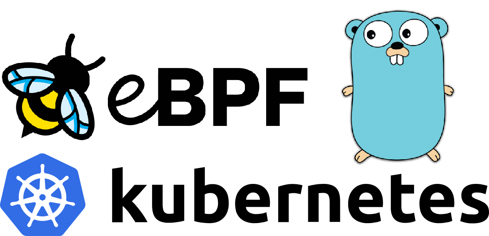

# eBPF 101: Your 2024 Guide to Node Network Visibility (Part 1)



Welcome to the first instalment of our series on leveraging the capabilities 
of `eBPF` (Extended Berkeley Packet Filter) for comprehensive network visibility.
In this multi-part series, we will dive into the powerful world of `eBPF`,
exploring how we can gain insights from the network activity within our `k8s` nodes.
Throughout this journey, we'll be utilizing the dynamic duo of `Golang` and `C` to harness the full potential of `eBPF`.

Today we will be using the `SEC("socket")` macro with the `__sk_buff` struct on
the `eBPF` side to monitor and manage the network,
while using [bpf2go](https://pkg.go.dev/github.com/cilium/ebpf/cmd/bpf2go)
on the client side to inject the `eBPF` code into the kernel.

*Please note* that in this tutorial we will only print the source and destination IPs of the packets travelling in our network.
The next guides will concentrate on parsing and printing the actual payload of interesting packets.

Let's get started!

## Prerequisites

### Golang

`Golang` will be used for writing the client side code and then injecting the whole `eBPF` program into the kernel.

### Kubernetes Cluster

The cluster will be used for 2 things:

- To have a network to monitor.
- Dev Container to develop the `eBPF` code on - make sure to deploy it with `hostNetwork: true`.

We are using a local [k3d](https://k3d.io/) cluster installed locally but you can use any `k8s` cluster.

### Dev Container

Instantly inject the program into the node’s kernel
(If there are multiple nodes, the `eBPF` program should be deployed as a `DaemonSet`),
and easily develop a program that will work on any machine.
This is the `Dockerfile` we used as our dev container:

```Dockerfile
FROM golang:1.22.1

RUN apt update  && \
    apt upgrade && \
    apt install -y wget clang llvm libbpf-dev curl git make sudo build-essential

ENTRYPOINT [ "tail", "-f", "/dev/null" ]
```

The created image will contain everything we need to generate, build and run our `eBPF` program!


## Kernel Side Code

### Includes

Let's create a new file - `socket.c` and populate it with the following:

```c
//go:build ignore

#include <linux/in.h>
#include <linux/ip.h>
#include <linux/bpf.h>
#include <linux/if_ether.h>
#include <bpf/bpf_endian.h>
#include <bpf/bpf_helpers.h>

...
```

The `//go:build ignore` is required to tell the go compiler to ignore this `C` file when building our code (since the compiler does not allow compiling c files without importing the `cgo` library.

### Definitions and Structs

```c
char LICENSE[] SEC("license") = "Dual BSD/GPL";

#define IP_MF       0x2000
#define IP_OFFSET   0x1FFF
#define ETH_HLEN    14
#define be32toh(x) ((__u32)(x)) // Define the byte order conversion for big-endian to host

// Taken from uapi/linux/tcp.h
struct __tcphdr {
	__be16  source;
	__be16  dest;
	__be32  seq;
	__be32  ack_seq;
	__u16   res1 : 4, doff : 4, fin : 1, syn : 1, rst : 1, psh : 1, ack : 1, urg : 1, ece : 1, cwr : 1;
	__be16  window;
	__sum16 check;
	__be16  urg_ptr;
};

...
```

For `eBPF` code to be loaded into the kernel, it must have a `SEC("license")`.
Each `eBPF` program that runs on the kernel must have a license as programs are required to be GPL-compatible.

The `SEC()` macro is responsible to put the defined object in the given ELF section, e.g. the `maps` section, `license` section or the `socket` section.

The `__tcphdr` struct is defined because we did not want to install additional `apt` packages for only one header file.

### Helping Methods

```c
// Check if the socket packet received is an IP fragment.
static inline int ip_is_fragment(struct __sk_buff *skb, __u32 nhoff) {
	__u16 frag_off;

	bpf_skb_load_bytes(skb, nhoff + offsetof(struct iphdr, frag_off), &frag_off, 2);
	frag_off = __bpf_ntohs(frag_off);
	return frag_off & (IP_MF | IP_OFFSET);
}

// Printing the received IP from __be32 into a human readable string
void print_be32_as_ip(__be32 ip, __u16 proto, __u32 ip_proto) {
    __u32 host_ip = be32toh(ip); // Convert from big-endian to host byte order

    // Extract the individual bytes
    __u8 byte1 = (host_ip >> 24) & 0xFF;
    __u8 byte2 = (host_ip >> 16) & 0xFF;
    __u8 byte3 = (host_ip >> 8) & 0xFF;
    __u8 byte4 = host_ip & 0xFF;

    bpf_printk("\t* Parsed IP %d.%d.%d.%d", byte4, byte3, byte2, byte1);
}
```

Those 2 methods will be used in the following section.

### The Main SEC macro

```c
SEC("socket")
int socket_handler(struct __sk_buff *skb) {
	
...
}
```

The `SEC()` macro above the method, tells the kernel to run our method before
The kernel itself does something with the received packet.
We received a pointer to the `__sk_buff` struct which will hold information about the socket and the data it transfers.

### Packets Protocol

```c
__u16 proto;
__u32 nhoff = ETH_HLEN;

bpf_skb_load_bytes(skb, 12, &proto, 2);
proto = __bpf_ntohs(proto);
if (proto != ETH_P_IP) {
	return 0;

if (ip_is_fragment(skb, nhoff)) {
	return 0;
}

...
```

Here we load the packet's layer 3 protocol into the `proto` variable, and check if it's an Internet Protocol packet.

### Checking the packets Header size

```c
__u8 hdr_len;

bpf_skb_load_bytes(skb, ETH_HLEN, &hdr_len, sizeof(hdr_len));
hdr_len &= 0x0f;
hdr_len *= 4;

// Verify hlen meets minimum size requirements
if (hdr_len < sizeof(struct iphdr)) {
	return 0;
}

...
```

Here we check if the packets header length is not corrupted while it traveled in the network,
if it is, we won't be able to parse it.

### TCP or somethine else?

```c
__u32 ip_proto	= 0;
bpf_skb_load_bytes(skb, nhoff + offsetof(struct iphdr, protocol), &ip_proto, 1);

// Is it a TCP packet? Protocol field == 6
if (ip_proto == IPPROTO_TCP) {
	bpf_printk("The packet was sent using protocol %d", ip_proto);
	
...
```

The `ip_proto` variable will be used to filter `TCP` packets from the rest,
as this is the type of packet we are after.

Each packet type (`TCP`, `UDP`, `amqp`, `gRPC`, ...) have to be parsed in a different way later on.
This subject will be discussed in a future blog article.

### Source and Destination IPs!

Now let's load the IPs and ports and start brewing our tea 🍵!

```c
__be32 src_address;
__be32 dst_address;
bpf_skb_load_bytes(skb, nhoff + offsetof(struct iphdr, saddr), &src_address, 4);
bpf_skb_load_bytes(skb, nhoff + offsetof(struct iphdr, daddr), &dst_address, 4);

...
```

### Source and Destination Ports!

```c
__be16 ports[2];
bpf_skb_load_bytes(skb, nhoff + hdr_len, &ports, 4);

__le16 src_port = ports[0];
__le16 dst_port = ports[1];

// The ports are read as big endian. The following lines convert it to little endian.
// e.g. port 8000 is represented as 1f40 but the actual data is 401f thus the bytes must be swapped.
src_port = ((src_port>>8) | (src_port<<8));
dst_port = ((dst_port>>8) | (dst_port<<8));

...
```

Both source and destination ports are stored together in the beginning of the tcp header, each port is represented as an unsigned 16-bit number - hence we extract 4 bytes (32 bits) from the packet's data. We start reading from the offset pointing to the beginning of the tcp header that comes after the ip header (the sum of the Ethernet header length - `nhoff`, and the IP header length - `hdr_len`.

### Last job - Printing the IPs and the Ports

```c
bpf_printk("Packet was sent from:");
print_be32_as_ip(src_address, proto, ip_proto);
bpf_printk("\tFrom port: %d", src_port);
bpf_printk("Its destination is:");
print_be32_as_ip(dst_address, proto, ip_proto);
bpf_printk("\tTo port: %d", dst_port);
```

Using `bpf_printk()` and `print_be32_as_ip()` we will print the IPs and the ports on the kernel side.

Now we are ready to write our client side code!

## Client Side Code

`Golang` will be used for 2 purposes:

- Writing the client side program - What to do with the packets data received from the kernel (In the next tutorials).
- Injecting the `eBPF` code into the kernel - To load our `C` program into the kernel in order to extend its behaviour.

### Golang Package

We need to create a new project:

```shell
go mod init ebpf-tutorial
```

Now we will download one package `bpf2go` which can be added like this:

```shell
go get github.com/cilium/ebpf/cmd/bpf2go

go mod tidy
```

### Configuring Network Interface

Let's create a `main.go` and populate it with:

```go
package main

import (
    "os"
    "net"
    "log"
    "unsafe"
    "syscall"
    "encoding/binary"
)

//go:generate go run github.com/cilium/ebpf/cmd/bpf2go bpf socket.c -- -I./headers -I/usr/include/aarch64-linux-gnu

func main() {
	// Making sure the user added a network interface as an argument.
	if len(os.Args) < 2 {
		log.Fatalf("Please specify a network interface")
	}

	// Look up the network interface by name.
	ifaceName := os.Args[1]
	iface, err := net.InterfaceByName(ifaceName)
	if err != nil {
		log.Fatalf("lookup network iface %q: %s", ifaceName, err)
	}
    	
	...
}
```

The `//go:generate …` comment will be used later to tell `Golang` what files to compile using `bpf2go`.

The first if statement in our main() function checks if the user executed the eBPF code with
a network interface as we need to tell the kernel which network interface we're going to monitor.

The `net.InterfaceByName(ifaceName)` checks if the user requested an existing network interface
and did not provide us with something imaginary (just in case).

### Loading the Compiled C Code

In the `C` section of this tutorial we will generate some objects.
Now we need to load them:

```c
// Load pre-compiled programs into the kernel.
objs := bpfObjects{}
if err := loadBpfObjects(&objs, nil); err != nil {
	log.Fatalf("loading objects: %s", err)
}
defer objs.Close()

...
```

### Injecting the eBPF code to Manipulate the Kernel’s Socket behaviour

The following section will load the eBPF program (which we will write soon)
into the kernel so it can be executed on each socket event.

```golang
// Loading the C code into the kernel.
socketFd, err := syscall.Socket(syscall.AF_PACKET, syscall.SOCK_RAW, int(htons(syscall.ETH_P_ALL)))
if err != nil {
	log.Fatalf("failed to create socket: %s", err)
}
defer syscall.Close(socketFd)

fd := objs.SocketHandler.FD()
if err := syscall.SetsockoptInt(socketFd, syscall.SOL_SOCKET, SO_ATTACH_BPF, fd); err != nil {
	log.Panic(err)
}
defer syscall.SetsockoptInt(socketFd, syscall.SOL_SOCKET, SO_DETACH_BPF, fd)

log.Printf("Attached socket program to iface %q (index %d)", iface.Name, iface.Index)
log.Printf("Press Ctrl-C to exit and remove the program")
for {
}
```

## Generating, Building and running the eBPF Code

### Generating eBPF Code

To load the `eBPF` program into the kernel, we need to compile it and generate some go files which create structs we use in the user-space code. To do that we will use the `bpf2go` library which is specified in the `go:generate` marker comment in the beginning of the `main.go` file:

```shell
go generate
```

```log
Compiled /home/ebpf-101-network-visibility/bpf_bpfel.o
Stripped /home/ebpf-101-network-visibility/bpf_bpfel.o
Wrote /home/ebpf-101-network-visibility/bpf_bpfel.go
Compiled /home/ebpf-101-network-visibility/bpf_bpfeb.o
Stripped /home/ebpf-101-network-visibility/bpf_bpfeb.o
Wrote /home/ebpf-101-network-visibility/bpf_bpfeb.go
```

This generated 4 new files:

- `bpf_bpfel.o`
- `bpf_bpfel.go`
- `bpf_bpfeb.o`
- `bpf_bpfeb.go`

Those files are created by the package `bpf2go` that we downloaded before.

### Building the Executable

```shell
go build
```

This command will build the executable file that we will run on the `k8s` cluster
to load the `eBPF` program: `ebpf-tutorial`.

### Running the Executable

To run it just use:

```shell
./ebpf-tutorial
```

```log
2024/03/22 13:22:57 Please specify a network interface
```

We forgot to add a network interface...
Let's try again:

To run it just use:

```shell
./ebpf-tutorial eth0
```

```log
2024/03/22 13:23:45 Attached socket program to iface "eth0" (index 18)
2024/03/22 13:23:45 Press Ctrl-C to exit and remove the program
```

Congrats! Your `eBPF` program is running!

### Checking out the results

Remember we said that no client side code will be written? This is why the logs are empty.
If you paid attention, we printed the IPs and the ports on the kernel side using `C`.
Therefore, we need to access the kernel's tracing file to see our printings.

On a different terminal in the same pod run this:

```shell
mount -t debugfs none /sys/kernel/debug
```

This command will allow us to access and `cat` the kernel's tracing file using:

```shell
cat /sys/kernel/debug/tracing/trace_pipe
```

Now you will see all `TCP` packets using `ipv4` sent over your `k8s` network.


#### Packet Example

On a different namespace we have 2 deployments:

- A [RabbitMQ](https://www.rabbitmq.com) server:
	```yaml
	Name:             rabbitmq-0
	Namespace:        rabbitmq
	Status:           Running
	IP:               10.42.0.79
	```

- A micro-service which sends data to the `RabbitMQ` server.
	```yaml
	Name:             rmq-publisher-b8f599454-rc4md
	Namespace:        rabbitmq
	Status:           Running
	IP:               10.42.0.76
	```

This is the log our kernel wrote:

```log
rmq-publisher-6129    [006] b.s11  8873.711583: bpf_trace_printk: Packet was sent from:
rmq-publisher-6129    [006] b.s11  8873.711583: bpf_trace_printk:    * Parsed IP 10.42.0.76
rmq-publisher-6129    [006] b.s11  8873.711583: bpf_trace_printk:    From port: 56940
rmq-publisher-6129    [006] b.s11  8873.711583: bpf_trace_printk: Its destination is:
rmq-publisher-6129    [006] b.s11  8873.711584: bpf_trace_printk:    * Parsed IP 10.42.0.79
rmq-publisher-6129    [006] b.s11  8873.711584: bpf_trace_printk:    To port: 5672
```

Which is exactly what's happening over our network!

#### curl Example

Let's try running the following `curl` command to `GitHub` IP:

```shell
kubectl exec --tty rabbitmq-0 -n rabbitmq -- curl 140.82.121.3
```

Here is the kernel's log:

```log
curl-57429   [009] ..s11 10092.135680: bpf_trace_printk: The packet was sent using protocol 6
curl-57429   [009] ..s11 10092.135709: bpf_trace_printk: Packet was sent from:
curl-57429   [009] ..s11 10092.135709: bpf_trace_printk:    * Parsed IP 10.42.0.79
curl-57429   [009] ..s11 10092.135709: bpf_trace_printk:    From port: 35660
curl-57429   [009] ..s11 10092.135709: bpf_trace_printk: Its destination is:
curl-57429   [009] ..s11 10092.135709: bpf_trace_printk:    * Parsed IP 140.82.121.3
curl-57429   [009] ..s11 10092.135709: bpf_trace_printk:    To port: 80

...

<idle>-0       [000] bNs.1 10092.135927: bpf_trace_printk: The packet was sent using protocol 6
<idle>-0       [000] bNs.1 10092.135938: bpf_trace_printk: Packet was sent from:
<idle>-0       [000] bNs.1 10092.135939: bpf_trace_printk:    * Parsed IP 140.82.121.3
<idle>-0       [000] bNs.1 10092.135939: bpf_trace_printk:    From port: 80
<idle>-0       [000] bNs.1 10092.135939: bpf_trace_printk: Its destination is:
<idle>-0       [000] bNs.1 10092.135939: bpf_trace_printk:    * Parsed IP 10.42.0.79
<idle>-0       [000] bNs.1 10092.135939: bpf_trace_printk:    To port: 35660
```

In this example we printed the request's packet details as it left our `rabbitmq-0` pod,
and then the response's  packet details that was returned from `GitHub` to our pod!

## Summary

In this tutorial, we:

1. Used `bpf2go` Golang library to load our `eBPF`
Code into the k8s kernel
2. Learned about `SEC("socket")` and what it does.
3. Parsed the arriving socket packets on the kernel side.
4. Ran the eBPF code!

You can find the full source code in the following link: https://github.com/beaverrio/ebpf-101-network-visibility

In the next post we will parse the payload itself to see the actual traffic in our network.

Let us know what else you would like to learn about eBPF and networking!
